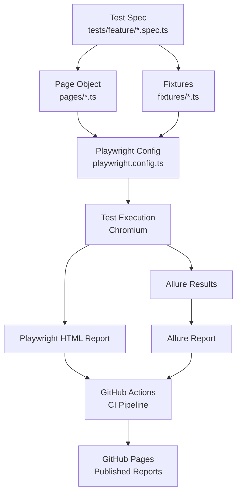

# Architecture

This document explains how the pieces of this framework fit together, from a
test spec running locally to a published report on GitHub Pages.

## High-Level Flow

## Layer Breakdown

### Test Specs (`tests/`)

Organized by feature (`login/`, `inventory/`, `cart/`, `checkout/`, `e2e/`,
`visual/`) rather than by test type. Each spec is tagged (`@smoke`,
`@regression`, `@visual`) so CI and local runs can filter by tag without
needing separate folder structures for the same purpose.

### Page Objects (`pages/`)

Encapsulate locators and actions for each page of the app (e.g.
`LoginPage`, `InventoryPage`, `CartPage`, `CheckoutPage`). Test specs call
methods on these classes rather than interacting with selectors directly,
keeping specs readable and centralizing UI changes to one place if
SauceDemo's markup ever changes.

### Fixtures (`fixtures/`)

Custom Playwright fixtures (e.g. a pre-authenticated `page` fixture) that
remove repeated setup code (like logging in) from every individual test.

### Configuration (`playwright.config.ts`)

Central control point: base URL (from `.env`), browser projects (Chromium),
retry policy (0 locally / 2 in CI), trace/screenshot/video capture rules,
and reporter configuration (HTML + Allure simultaneously).

### Reporting

Two reporters run on every test execution:

- **Playwright HTML Report** — built-in, fast, good for quick local debugging
- **Allure Report** — richer visualization (history trends, categorization,
  attachments) generated from `allure-results/` via the Allure CLI

### CI/CD (`.github/workflows/ci.yml`)

On every push/PR to `main`: installs dependencies, lints, checks formatting,
runs the test suite, generates both reports, and (on push to `main` only)
publishes a combined report site to the `gh-pages` branch via GitHub Pages.

### Quality Gates (local, pre-CI)

Husky + lint-staged run ESLint and Prettier on staged files before every
commit; commitlint enforces Conventional Commits format on every commit
message. This catches issues before they ever reach CI, rather than relying
on CI as the only gate.
